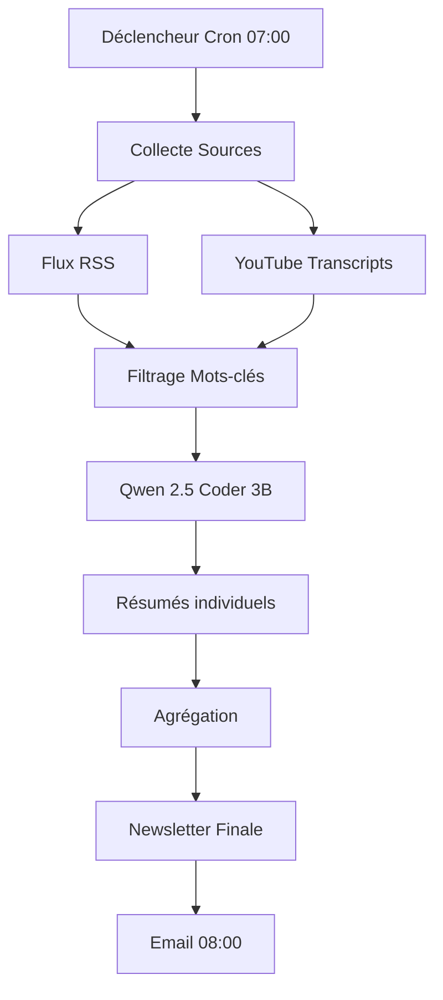

# Architecture du Système de Veille Techno

## Vue d'ensemble

## Composants

### 1. Orchestration (N8N)
- **Planification** : Cron Trigger (tous les jours à 07:00)
- **Collecte** : HTTP Requests vers RSS feeds et YouTube API
- **Traitement** : Boucles sur items + appels Ollama
- **Livraison** : Node Email (SMTP)

### 2. IA Locale (Ollama + Qwen)
- **Modèle** : `qwen2.5-coder:3b-instruct`
- **Endpoint** : `http://localhost:11434/api/generate`
- **Performance** : ~30-60s par article, 2-3min par vidéo YouTube

### 3. Sources de Données
#### RSS
- **US** : OpenAI Blog, Google AI, MIT Tech Review, Microsoft AI, Anthropic, TechCrunch AI
- **EU** : Mistral AI, N8N Blog, SAP Tech, Sifted.eu
- **CN** : TechNode, SCMP Tech, Qwen/DeepSeek Blogs
- **Concurrents** : ActivePieces, Flowise, Kestra, Windmill, Node-RED

#### YouTube (Transcripts)
- N8N Official
- Liam Ottley
- Matthew Berman
- AI Explained
- Two Minute Papers

#### Nouveautés N8N
- GitHub Releases (Atom Feed)
- N8N Community Forum

## Workflow N8N

### Étapes Principales
1. **Trigger** : Schedule (Cron: 0 7 * * *)
2. **Fetch RSS** : Loop sur sources RSS
3. **Fetch YouTube** : Loop sur chaînes YouTube (via youtube-transcript-api)
4. **Filter** : Mots-clés (IA, LLM, Automatisation, Agent)
5. **Summarize** : HTTP POST vers Ollama pour chaque item
6. **Aggregate** : Merge tous les résumés
7. **Final Pass** : Ollama génère la newsletter structurée
8. **Send Email** : SMTP à 08:00

### Format Newsletter
- **Gros Titres**
- **Nouveautés N8N**
- **Analyse Technique**
- **Veille Concurrentielle**
- **Vidéos à ne pas manquer**
